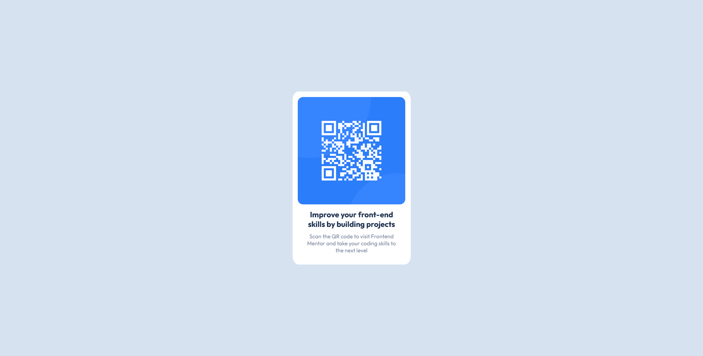

# Frontend Mentor - QR code component solution

This is a solution to the [QR code component challenge on Frontend Mentor](https://www.frontendmentor.io/challenges/qr-code-component-iux_sIO_H). Frontend Mentor challenges help you improve your coding skills by building realistic projects. 

## Table of contents

- [Overview](#overview)
  - [Screenshot](#screenshot)
- [My process](#my-process)
  - [Built with](#built-with)
  - [What I learned](#what-i-learned)


## Overview

### Screenshot



### Links

- Live Site URL: [https://justine-5.github.io/qr-code-component-main/](https://justine-5.github.io/qr-code-component-main/)

## My process

### Built with

- Semantic HTML5 markup
- CSS properties
- Flexbox

### What I learned

#### favicon is the icon for the page.
#### it is better to link a font in html than importing in the css file.
#### target="_blank" to open a link in a new tab.
#### need to height:100% to center a div usinig flexbox:

```css
html, body, main{
  background: hsl(212, 45%, 89%);
  height: 100%;
}

main {
  display: flex;
  align-items: center;
  justify-content: center;
}
```